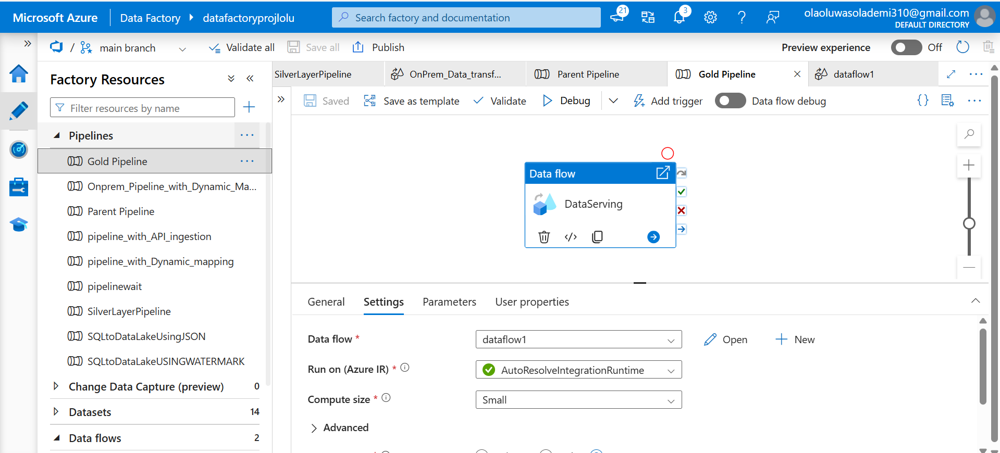

# Azure-Data-Engineering-Project-with-Azure-Data-Factory and Azure DevOps

## 🚀 Project Overview

This end-to-end data engineering project demonstrates how to design, build, and orchestrate a complete modern data platform solution using **Azure Data Factory**, **Azure DevOps**, and **Azure Data Lake Storage Gen2** — following the **medallion architecture** (Bronze → Silver → Gold).

The pipeline extracts data from multiple sources — **On-Prem CSV**, **Azure SQL Database**, and **GitHub-hosted JSON via API** — performs transformations using **ADF Data Flows**, and stores refined datasets in distinct layers. The final Gold layer is a business-ready aggregated view, orchestrated with failure handling and CI/CD using Azure DevOps.

---

## 📌 Architecture

---

## 📂 Data Sources

| Source Type | Dataset | Description |
|------------|---------|-------------|
| 🖥️ On-Prem (via SHIR) | `DimFlight.csv`, `DimAirline.csv`, `DimPassenger.csv` | Static CSVs stored locally |
| 🌐 API (GitHub) | `DimAirport.json` | Pulled via REST API |
| 💾 Azure SQL DB | `FactBookings` | 

---

## 🔁 Data Pipeline Flow

1. **Bronze Layer (Raw Zone)**  
   - Ingested from:
     - On-prem CSVs using **Self-Hosted IR**
     - GitHub API using **Web API activity**
     - Azure SQL using **Incremental Load (Watermarking)**  
   - Stored in ADLS Gen2 → Bronze

2. **Silver Layer (Cleansed Zone)**  
   - Transforms and enriches data using **ADF Data Flows**
   - Applies column derivations, filtering, joins, and type casting

3. **Gold Layer (Business Zone)**  
   - Aggregated view using FactBookings and dimension tables
   - Used for business insights and analytics reporting

---

## 📌 Pipeline Details

### 1. On-Prem Ingestion Pipeline

---

### 2. GitHub API Ingestion Pipeline

---

### 3. Azure SQL to Bronze (Incremental Load)

---

### 4. Silver Layer Transformation

---

### 5. Silver Data Flow Transformations

---

### 6. Gold Layer Pipeline (Business View)

---

### 7. Parent Orchestration Pipeline

---

## ⚙️ CI/CD with Azure DevOps

- Connected to DevOps Git Repos via **Git Integration**
- 3 branches:
  - `main`: Production-ready code
  - `feature`: Development
  - `adf_publish`: ARM Templates for release pipeline
- Supports **release automation** using the exported ARM templates

---

## 📈 Technologies Used

- **Azure Data Factory**
- **Azure Data Lake Storage Gen2**
- **Azure SQL Database**
- **Azure DevOps (Repos & Pipelines)**
- **GitHub REST API**
- **Self-hosted Integration Runtime (SHIR)**
- **Azure Logic Apps** (for alerts)

---

## 🧠 Key Learnings

- Implemented **parameterized pipelines** for dynamic ingestion
- Automated **data orchestration** across various sources
- Applied **data transformation logic** using ADF Data Flows
- Leveraged **CI/CD best practices** with Azure DevOps
- Used **ARM Templates** for consistent deployment

---

## ✅ Final Output

A fully automated, modular, and scalable ADF solution that:
- Supports dynamic ingestion from multiple sources
- Applies transformation logic per medallion architecture
- Automates deployment and alerting
- Is CI/CD ready for enterprise-grade production use

